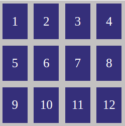
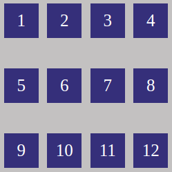
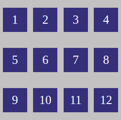

# CSS Flexbox

## O que vamos aprender?

Você irá aprender como utilizar o módulo Flexbox para criar layouts de uma maneira mais eficiente. Verá como funcionam os eixos do flexbox e quais propriedades utilizamos para posicionar os items verticalmente e horizontalmente. Também irá aprender como adicionar quebras de linhas e a ajustar o posicionamento delas em conteiners com vários items.

## Você será capaz de:

- Entender o que é um **flexbox container** e o que é um **flexbox item**.
- Entender como os eixos do layout flexbox se comportam.
- Posicionar **flexbox items** dentro de **flexbox containers**.
- Mudar o sentido e direção que os items são dispostos dentro do **flex container**.
- Impedir que itens "vazem" o **flex container** e configurar como as linhas são quebradas.
- Ajustar posicionamento das linhas.

## Por que isso é importante?

Até então você utilizou as propriedades **display** (inline, block, inline-block), **position** e **float** para posicionar os elementos que compõem o layout. Embora essas propriedades sejam extremamente úteis e terem seus casos de uso, elas apresentam algumas dificuldades quando utilizadas para resolver alguns tipos de problemas, por exemplo:

- Centralizar elementos verticalmente dentro de um elemento pai
- Trabalhar com medidas e tamanhos dinâmicos
- Distribuir o espaço do elemento pai entre elementos filhos
- Ajustar a altura e largura de elementos de acordo com o elemento pai

Em um mundo em que temos diversos tipos de dispositivos, com variados tamanhos de telas, se torna cada vez mais importante a criação de layouts que se adaptem. O flexbox nos ajuda a realizar essa tarefa de uma maneira mais fácil e eficiente.

## Conteúdos

### Parte 1 - Conceitos

#### Utilizando o flexbox

  Para utilizar o flexbox, você deve atribuir a propriedade `display: flex` ou `display: inline-flex` ao elemento pai (aquele que está contendo os elementos que você quer posicionar), assim ele se tornará um **Flex container** e seus filhos diretos se tornarão **Flex items**. A diferença entre display `flex` e `inline-flex` é parecida com a diferença entre `block` e `inline-block`, elementos `flex` ocupam todo o espaçamento horizontal da página, enquanto elementos `inline-flex` mantém todas as funcionalidades do flexbox, porém, ocupam apenas o espaço horizontal necessário para acomodar seus **Flex items**.

#### Flex containers e flex items

  Pense no flexbox como uma ferramenta para especificar o posicionamento de **Flex items** dentro de **Flex containeres**, você verá mais adiante que um elemento pode ser **Flex container** e **Flex item** ao mesmo tempo.

#### Flex axis

  

  O módulo flexbox trabalha com dois eixos: **main axis** e **cross axis**. Sendo **main axis** o eixo principal e o **cross axis** o eixo perpendicular, ou seja, quando um está na horizontal o outro está na vertical. Podemos alterar a direção do main axis, consequentemente, alterando a direção do cross axis. A propriedade que utilizamos para fazer isso é a `flex-direction` e por padrão ela tem o valor `row` (horizontal).

  <br clear="right"/>
  </br>

  

  Alterando a propriedade `flex-direction` para `column`, mudamos a direção do main-axis para vertical e consequentemente o cross axis para horizontal.

  <br clear="left"/>
  </br>

  Você utilizará esses eixos quando for alinhar **items** horizontalmente ou verticalmente dentro de **container**.

  Existem três informações importantes sobre os eixos: **onde começa**, **onde termina** e **qual o tamanho**. 

  - **Onde começa e onde termina?**

    Por padrão o **main axis** começa na extremidade esquerda do container e termina na extremidade direita e o **cross axis** começa na extremidade superior e termina na extremidade inferior. Para você lembrar mais facilmente, pode pensar que eles estão no fluxo da nossa escrita, o **main-axis** da esquerda pra direita e o **cross axis** de cima pra baixo. 
    
    **OBS:** Lembre-se que é possível mudar o sentido e direção do **main axis** e consequentemente do **cross axis** utilizando a propriedade `flex-direction`.

  - **Qual o tamanho?**

    O tamanho dos eixos será dado de acordo com o `width` e o `height` do container. Se o **main axis** estiver na direção horizontal, ele ocupará a largura do elemento, caso esteja na vertical, ocupará a altura. O mesmo é valido para o **cross axis**.

### Parte 2 - Flex Container

Acima você aprendeu o funcionamento do layout no flexbox, agora você verá as propriedades que pode utilizar no **Flex container** para posicionar os seus **Flex items**.

- **flex-direction:** Essa propriedade é utilizada para mudar o sentido e a orientação do **main axis** e terá impacto no funcionamento das outras propriedades.

  - **row (default):** Valor padrão, sentido horizontal, direcionado da esquerda para direita.
  
  <p align="center">
    
  </p>

  - **row-reverse:** sentido horizontal, direcionado da direita para esquerda.

  <p align="center">
    
  </p>

  - **column:** sentido vertical, direcionado de cima para baixo.

  <p align="center">
    
  </p>

  - **column-reverse:** sentido vertical, direcionado de baixo para cima.

  <p align="center">
    
  </p>

  Abaixo uma tabela relacionando onde os elementos começam e terminam quando usamos as propriedades `justify-content`, `align-items` e `align-content` de acordo com o `flex-direction`:

  - **left-to-right:** começa no lado esquerdo e termina no direito.
  - **right-to-left:** começa no lado direito e termina no esquerdo.
  - **top-to-bottom:** começa no lado de cima e termina no de baixo.
  - **bottom-to-top:** começa no lado de baixo e termina no de cima.

  <p align="center">
    
  </p>

  **Prática:** [**clique aqui**](https://codepen.io/paulohbsimoes/full/YzGzOvN) para entender o comportamento da `flex-direction` e em seguida [**clique aqui**](https://codepen.io/paulohbsimoes/full/XWjJjbx) para fazer os exercícios de fixação.

---

- **flex-wrap:** Quando se tem diversos elementos dentro de um container e o espaço é insuficiente para cabê-los, eles irão "vazar". O motivo é que por padrão essa propriedade tem o valor `nowrap`, mas podemos alterar este comportamento para fazer "quebras de linha", como você verá a seguir.

  - **nowrap (default):** Comportamento padrão, os elementos "vazam", porém, não irão atrapalhar o posicionamento do elementos que estão fora do **Flex container**, e se quisermos podemos usar a propriedade `overflow: hidden` para escondê-los.

  <p align="center">
    
  </p>

  - **wrap:** Utilizado para "quebrar a linha" quando o espaço que ela tem para os elementos for insuficiente. Os elementos serão colocados na linha de baixo.

  <p align="center">
    
  </p>

  - **wrap-reverse:** Mesmo comportamento de `wrap` porém, agora os elementos serão colocados na linha de cima, "empurrando" tudo pra baixo.

  <p align="center">
    
  </p>

  <br/>

  **Prática:** [**clique aqui**](https://codepen.io/paulohbsimoes/full/dypyqgO) para entender o comportamento do `flex-wrap` e em seguida [**clique aqui**](https://codepen.io/paulohbsimoes/full/LYRERVK) para fazer os exercícios de fixação.

---

- **justify-content:** Esta propriedade é utilizada para alinhar os **Flex items** em relação ao **main axis**.

  - **flex-start (default):** Alinha ao começo do **main axis**.

  <p align="center">
    
  </p>

  - **flex-end:** Alinha ao final do **main axis**.

  <p align="center">
    
  </p>

  - **center:** Alinha ao centro do **main axis**.

  <p align="center">
    
  </p>

  - **space-between:** Distribui o espaço livre do **main axis** igualmente nos vãos entre os elementos, o primeiro **Flex item** não terá nenhum espaçamento à esquerda, e o último não terá nenhum espaçamento à direita.
  
  <p align="center">
    
  </p>

  - **space-around:** Distribui o espaço livre do **main axis** para criar margens de mesmo valor nos **flex items**. O efeito é que nos pontos em que uma margem encontra com outra os espaços são maiores, o primeiro elemento terá um espaçamento menor à esquerda e o último terá um espaçamento menor a direita.

  <p align="center">
    
  </p>

  - **space-evenly:** Distribui o espaço livre do **main axis** igualmente em todos os espaços entre os elementos, incluindo à esquerda do primeiro e à direita do último. A diferença entre `space-evenly` e `space-around` é sutil, mas fica mais perceptível em **Flex containeres** de tamanho maior.

  <p align="center">
    
  </p>

  <br/>

  **Prática:** [**clique aqui**](https://codepen.io/paulohbsimoes/full/ZEpEMmd) para entender o comportamento do `justify-content` e em seguida [**clique aqui**](https://codepen.io/paulohbsimoes/full/WNGbGQE) para fazer os exercícios de fixação.

---

- **align-items:** Esta propriedade é utilizada para alinhar os **Flex items** em relação ao **cross axis**.

  - **stretch (default):** "Estica" os **Flex items** para ocuparem todo o espaço do **cross axis**

  <p align="center">
    
  </p>

  - **flex-start:** Alinha ao começo do **cross axis**.

  <p align="center">
    
  </p>

  - **flex-end:** Alinha ao final do **cross axis**.

  <p align="center">
    
  </p>

  - **center:** Alinha ao centro do **cross axis**.

  <p align="center">
    
  </p>

  - **baseline:** Alinha de acordo com a baseline da fonte dos **Flex items**.

  <p align="center">
    
  </p>

  <br/>

  **Prática:** [**clique aqui**](https://codepen.io/paulohbsimoes/full/abmbaMv) para entender o comportamento do `align-items` e em seguida [**clique aqui**](https://codepen.io/paulohbsimoes/full/LYRERpw) exercícios de fixação.

---

- **align-content:** Esta propriedade só funcionará em **Flex containers** que tiverem a propriedade `flex-wrap` igual a `wrap` ou `wrap-reverse`. Quando temos múltiplas "linhas" utilizamos esta propriedade para posicioná-las ou distribuir o espaço livre em relação ao **cross axis**.

  - **flex-start:** Alinha linhas ao começo do **cross axis**.

  <p align="center">
    
  </p>

  - **flex-end:** Alinha linhas ao final do **cross axis**.

  <p align="center">
    
  </p>

  - **center:** Alinha linhas ao centro do **cross axis**.

  <p align="center">
    
  </p>

  - **stretch:** Estica linhas para ocuparem todo o espaço do **cross axis**, por padrão o espaço será distribuido uniformemente.
  <!-- Note que no primeiro exemplo (à esquerda), os quadradros não preencheram toda a linha, isso porque quando aplicamos `stretch` na propriedade `align-content` estamos esticando a linha, e não os elementos que pertencem a ela. Se quisermos podemos aplicar o `stretch` também nos items, usando a propriedade `align-items`, como mostra o segundo exemplo. -->

  <p align="center">
    <!--  -->
    
  </p>

  - **space-between:** Distribui o espaço livre do **cross axis** igualmente nos vãos entre as linhas, a primeira linha não terá nenhum espaçamento acima, e a última não terá nenhum espaçamento abaixo.

  <p align="center">
    
  </p>

  - **space-around:** Distribui o espaço livre do **cross axis** igualmente para criar margens de mesmo valor nas linhas. O efeito prático é que nos pontos em que uma margem encontra com outra os espaços são maiores, a primeira linha terá um espaçamento menor acima e a última terá um espaçamento menor abaixo.

  <p align="center">
    
  </p>

  - **space-evenly:** Distribui o espaço livre do **cross axis** igualmente em todos os espaços entre as linhas, incluindo acima da primeira e abaixo da última.

  <p align="center">
    
  </p>

  <br/>

  **Prática:** [**clique aqui**](https://codepen.io/paulohbsimoes/full/xxExaNV) para entender o comportamento do `align-content` e em seguida [**clique aqui**](https://codepen.io/paulohbsimoes/full/yLayaej) para fazer os exercícios de fixação.

## Exercícios

Agora que você entendeu como o **flexbox layout** funciona e como posicionar **flex items** dentro de um **flex container**, chegou a hora de aplicar esses conhecimentos na construção de um layout. Ao finalizá-lo, ele terá o seguinte aspecto:

<p>
  
</p>

Crie uma nova branch dentro do seu repositório de exercícios. Os arquivos gerados deverão ser salvos em uma pasta, você também deverá fazer um commit ao final de cada tarefa e ao concluir os exercícios criar uma Pull Request para que os seus colegas possam fazer code-review.

Você deverá utilizar os seguintes arquivos como base:

- **index.html**

```html
<!DOCTYPE html>
<html lang="pt-br">
<head>
  <meta charset="UTF-8">
  <meta name="viewport" content="width=device-width, initial-scale=1.0">
  <title>CSS Flexbox</title>
  <link rel="stylesheet" href="style.css">
</head>
<body>
  <header>
    <h1 class="title">Título principal</h1>
  </header>
  <nav>
    <ul>
      <li>Opção 1</li>
      <li>Opção 2</li>
      <li>Opção 3</li>
      <li>Opção 4</li>
      <li>Opção 5</li>
    </ul>
    <div class="search">
      <form action="">
        <input type="text">
      </form>
      <span class="icon">&#128269;</span>
    </div>
  </nav>
  <main>
    <article>
      <section>
        <h2 class="title">Titulo da sessão 1</h2>
        <p>Lorem ipsum dolor, sit amet consectetur adipisicing elit. Similique, ab dolor! Dolorem unde, placeat cum
          iste, voluptates consequuntur vero, reiciendis animi optio quam dolore minus! Ipsam accusantium voluptate,
          velit libero repellat voluptatum ab commodi est iste aut, distinctio atque exercitationem eaque. Eveniet illo
          earum ab non ullam distinctio voluptatum est porro pariatur temporibus soluta, animi cum tempora accusantium,
          ea illum quisquam consequuntur minus. Aliquam assumenda soluta ad, harum dolore ipsam provident impedit
          veritatis enim maiores dolorem voluptates maxime, deleniti eos accusamus nobis recusandae pariatur voluptas
          neque. Itaque, minus fugit cumque quibusdam natus veritatis quis maiores quos unde dolores aspernatur debitis.
        </p>
        
      </section>
      <section>
        <h2 class="title">Titulo da sessão 2</h2>
        <p>Lorem ipsum dolor, sit amet consectetur adipisicing elit. Similique, ab dolor! Dolorem unde, placeat cum
          iste, voluptates consequuntur vero, reiciendis animi optio quam dolore minus! Ipsam accusantium voluptate,
          velit libero repellat voluptatum ab commodi est iste aut, distinctio atque exercitationem eaque. Eveniet illo
          earum ab non ullam distinctio voluptatum est porro pariatur temporibus soluta, animi cum tempora accusantium,
          ea illum quisquam consequuntur minus. Aliquam assumenda soluta ad, harum dolore ipsam provident impedit
          veritatis enim maiores dolorem voluptates maxime, deleniti eos accusamus nobis recusandae pariatur voluptas
          neque. Itaque, minus fugit cumque quibusdam natus veritatis quis maiores quos unde dolores aspernatur debitis.
        </p>
        
      </section>
    </article>
    <aside>
      <h2 class="title">Título do aside</h2>
      <ul>
        <li><a href="#">Link 1</a></li>
        <li><a href="#">Link 2</a></li>
        <li><a href="#">Link 3</a></li>
        <li><a href="#">Link 4</a></li>
        <li><a href="#">Link 5</a></li>
        <li><a href="#">Link 6</a></li>
        <li><a href="#">Link 7</a></li>
        <li><a href="#">Link 8</a></li>
        <li><a href="#">Link 9</a></li>
        <li><a href="#">Link 10</a></li>
      </ul>
    </aside>
  </main>
  <footer>
    <p>Mensagem de rodapé</p>
  </footer>
</body>
</html>
```

- **style.css**

```css
* {
  box-sizing: border-box;
  margin: 0;
  padding: 0;
}

body {
  font-size: 20px;
}

ul {
  list-style: none;
}

a {
  text-decoration: none;
}

header {
  background-color: rgba( 0 , 0 , 0 , 0.8 );
  color: white;
}

header .title {
  padding: 30px;
  text-align: center;
}

nav {
  background-color: rgb( 110 , 28 , 110 );
  color: white;
  padding: 10px;
}

nav ul li {
  min-width: 110px;
  padding: 10px 20px;
}

nav ul li:hover {
  color: orangered;
  cursor: pointer;
  transform: scale( 1.2 );
}

.search {
  display: flex;
}

.search input {
  align-items: center;
  display: flex;
  font-size: 24px;
  height: 100%;
  padding: 6px;
}

.search .icon {
  background-color: rgba( 255 , 255 , 255 , 0.3 );
  padding: 5px 10px;
}

.search .icon:hover {
  cursor: pointer;
}

main {
  background-color: rgba( 221 , 136 , 107 , 0.342 );
  min-height: 80vh;
}

article {
  background-color: rgba( 0 , 0 , 0 , 0.1 );
  flex: 1;
}

section {
  max-width: 600px;
  padding: 20px;
}

section .title , section p {
  margin-bottom: 20px;
}

aside {
  background-color: rgb( 78 , 92 , 50 );
  border-radius: 10px;
  color: white;
  height: 700px;
  margin: 10px;
  min-width: 350px;
}

aside .title {
  padding: 10px;
  text-align: center;
}

aside a {
  color: white;
}

aside ul {
  line-height: 30px;
  padding: 20px;
  text-align: center;
}

aside ul li:hover {
  background-color: rgba( 0 , 0 , 0 , 0.3 );
  cursor: pointer;
}

footer {
  background-color: rgba( 0 , 0 , 0 , 0.8 );
  color: white;
  font-size: 1.6rem;
  padding: 20px;
  text-align: center;
}
```
**[Clique aqui](https://codepen.io/paulohbsimoes/full/GRjRWLQ) para acessar um playground com referências de tudo que você aprendeu.**

**1.** Utilize o flexbox para alinhar as opções do menu lado a lado.

**2.** Faça com que as opções e o campo de pesquisa fiquem na mesma linha.

**3.** As opções e o campo de pesquisa devem ficar no centro do nav.

**4.** Ao redimensionar a página, quando o espaço do nav não couber o campo e as opções, deverá haver uma quebra de linha.

**5.** Centralize a lupa do campo de pesquisa para que ela fique exatamente no centro do quadrado.

**6.** Faça com que as seções do article fiquem lado a lado.

**7.** Distribua o espaço horizontal livre do article igualmente entre as seções.

**8.** Caso a página seja redimensionada e o espaço seja insuficiente para caber as seções, deverá haver quebra de linha.

**9.** Alinhe o conteúdo das seções ao centro horizontal. **Dica:** o valor padrão para `flex-direction` é `row` e para `align-items` é `stretch`.

**10.** Use o flexbox para colocar um espaçamento vertical entre o título e a lista de links do aside. O espaço acima do título e abaixo da lista deverá ser menor que o espaço entre o título e a lista.

**11.** Faça com que o aside fique do lado direito do main utilizando apenas o flexbox.

## Recursos Adicionais (opicional)

- [CSS Tricks - A Complete Guide to Flexbox](https://css-tricks.com/snippets/css/a-guide-to-flexbox/)

- [MDN - Flexbox](https://developer.mozilla.org/en-US/docs/Learn/CSS/CSS_layout/Flexbox)

- [w3schools - CSS Flexbox](https://www.w3schools.com/css/css3_flexbox.asp)

- [Mastery Games - Flex Zombies](https://mastery.games/flexboxzombies/)

- [Flexbox Froggy](https://flexboxfroggy.com/)

- [Learn Flexbox in 15 Minutes](https://www.youtube.com/watch?v=fYq5PXgSsbE&ab_channel=WebDevSimplified)